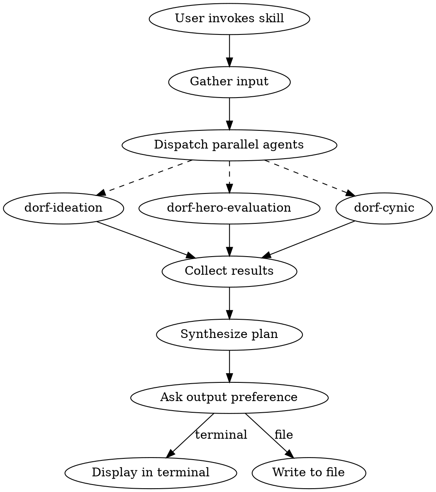

# Dorf Hero Design

## Overview

Orchestrates the full hero design workflow by running ideation, evaluation, and cynic review in parallel, then synthesizing results into a design plan.

## Hero Design Rules

**These rules are non-negotiable. Agents must follow them.**

### Skill Progression

| Level | Slot |
|-------|------|
| 1 | Skill 1 (all heroes) |
| 1 | Skill 2 (3★+ only) |
| 3 | Skill 3 |
| 6 | Skill 4 |
| 12 | Skill 5 |

### Level 1 Usability

- **1-2★ heroes**: Single skill at level 1 — MUST be usable (no passives)
- **3★+ heroes**: Two skills at level 1 — at least one MUST be usable (max 1 passive)

### Passive Limits

- Passives trigger automatically under specific circumstances
- 0 passives is the baseline — not every hero needs one
- Hard cap: 3 passives maximum
- Passives can modify or override Basic Attack behavior

### Basic Attack

- Cannot be changed directly via skills
- Can ONLY be modified through passive abilities

### Leader Skills (5★ Only)

5-star heroes have a Leader Skill that auto-triggers when conditions are met (hero must be party leader).

**Types:**
- **Passive** — Always-active stat bonuses (e.g., "+15% DEF to non-knights")
- **Timed** — Trigger at specific round (e.g., "Round 1: all allies gain +25% ATK for 2 turns")
- **Passive Regen** — Per-round healing based on each ally's max HP

See existing 5★ heroes for examples: Aurora the Dawn, Shadow King, Yggra, etc.

### Critical Hits Don't Exist

There is ONE item in the game that grants crit. Otherwise, **crit is not a mechanic**. Do not design around crit chance, crit damage, or crit synergies.

### Class Resource Systems

| Class | Resource | Mechanic |
|-------|----------|----------|
| **Berserker** | Rage (0-100) | Starts 0. +10 on attack, +10 when hit. Skills cost `rageCost`. `rageCost: 'all'` consumes all for scaling. |
| **Ranger** | Focus (binary) | Starts focused. Lost when hit/debuffed. Can't use skills without Focus. Regains from ally buffs. |
| **Knight** | Valor (0-100) | Starts 0. +5 when redirecting damage. Skills have `valorRequired` min, scale at tiers (0/25/50/75/100). |
| **Bard** | Verse (0-3) | All skills free, +1 Verse each. At 3/3, Finale auto-triggers next turn. No consecutive repeats. |
| **Alchemist** | Essence | Starts 50%, +10/turn. Volatility tiers: Stable (0-20), Reactive (21-40, +15% dmg), Volatile (41+, +30% dmg, 5% self-dmg). |
| **Paladin** | Faith (MP) | Starts 30%. Skills cost `mpCost`. |
| **Mage** | Mana (MP) | Starts 30%. Skills cost `mpCost`. |
| **Cleric** | Devotion (MP) | Starts 30%. Skills cost `mpCost`. |
| **Druid** | Nature (MP) | Starts 30%. Skills cost `mpCost`. |

## When to Use

- Brainstorming 1+ new heroes
- Designing a hero kit from scratch
- Getting feedback on new or existing skill designs

## Workflow



## Step 1: Gather Input

Ask the user:

1. **Theme/Request**: "What hero or concept do you want to design?"
   - Could be a class + role ("4-star Ranger tank")
   - A fantasy archetype ("plague doctor alchemist")
   - A mechanical hook ("hero that punishes enemy buffs")
   - Multiple heroes ("fill the 2-star gaps")

2. **Output preference**: "Display results in terminal, or write to a markdown file?"
   - Default: terminal
   - If file: ask for path or use default `docs/heroes/`

## Step 2: Dispatch Parallel Agents

Launch three agents simultaneously using the Task tool:

### Agent 1: Ideation
```
Invoke dorf-ideation skill for: [user's theme]
Generate ideas at "sketch" depth unless user specified otherwise.
Return the ideas without writing session files.
```

### Agent 2: Evaluation
```
Invoke dorf-hero-evaluation skill.
Focus evaluation on: [relevant class/role/rarity from theme]
Check for gaps this hero could fill.
Return findings without writing session files.
```

### Agent 3: Cynic
```
Invoke dorf-cynic skill.
As ideas come in, prepare to critique them.
If reviewing existing designs, critique those.
Return critique without session files.
```

## Step 3: Synthesize Results

Combine agent outputs into a coherent design plan:

1. **Best ideas** from ideation (filtered by evaluation gaps + cynic feedback)
2. **Recommended direction** with rationale
3. **Known risks** surfaced by cynic
4. **Implementation notes** (new systems needed, effect types, etc.)

### Orchestrator Decision Guidelines

When synthesizing conflicting feedback or making judgment calls:

1. **If all else is equal, choose the fun option** — Mechanical elegance matters, but player enjoyment wins ties
2. **No fan service** — No pandering designs, no waifu/husbando bait, no "cool for cool's sake" without mechanical substance
3. **Dark fantasy tone** — Dorf is gritty and atmospheric. Heroes can have personality and humor, but the world is dangerous and death is real. Avoid anime tropes, sanitized violence, or overly heroic framing

## Step 4: Output

### Terminal Display (default)
Present synthesis directly in conversation. User can ask follow-up questions.

### File Output
Write plan to markdown file:
- Default path: `docs/heroes/{hero-name}-design.md` or `docs/heroes/{date}-design-session.md`
- Custom path: whatever user specified

**Plan file structure:**
```markdown
# Hero Design: [Name/Theme]

**Date:** YYYY-MM-DD
**Request:** [Original prompt]

## Ideas Considered
[From ideation agent]

## Roster Context
[From evaluation agent - gaps filled, comparisons]

## Risks & Concerns
[From cynic agent]

## Recommended Design
[Synthesized recommendation]

## Implementation Notes
[New systems, effect types, data structures needed]
```

## Feedback Mode

When user asks for feedback on existing designs (not brainstorming new ones):
- Skip ideation agent
- Run evaluation + cynic on the provided design
- Default to terminal display
- User can still request file output with "write that down" or similar

## File Paths

- Default: `docs/heroes/`
- User can specify any path (including absolute paths like `C:\...`)
- Create directory if it doesn't exist
