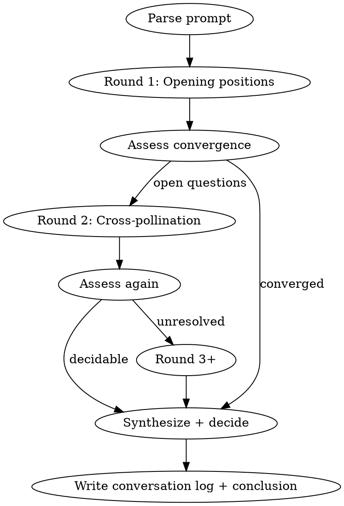

# Dorf Hero Design

## Overview

Orchestrates a multi-round design conversation between ideation, evaluation, and cynic agents. You are the **orchestrator** — you parse short prompts, run deliberation rounds, break ties, and produce a conversation log + conclusion file.

**Key difference from single-round dispatch:** Agents respond to *each other's* output across rounds. The orchestrator assesses convergence and decides when to stop.

## Hero Design Rules

**These rules are non-negotiable. Agents must follow them.**

### Skill Progression

| Level | Slot |
|-------|------|
| 1 | Skill 1 (all heroes) |
| 1 | Skill 2 (3-star+ only) |
| 3 | Skill 3 |
| 6 | Skill 4 |
| 12 | Skill 5 |

### Level 1 Usability

- **1-2-star heroes**: Single skill at level 1 — MUST be usable (no passives)
- **3-star+ heroes**: Two skills at level 1 — at least one MUST be usable (max 1 passive)

### Passive Limits

- Passives trigger automatically under specific circumstances
- 0 passives is the baseline — not every hero needs one
- Hard cap: 3 passives maximum
- Passives can modify or override Basic Attack behavior

### Basic Attack

- Cannot be changed directly via skills
- Can ONLY be modified through passive abilities

### Leader Skills (5-star Only)

5-star heroes have a Leader Skill that auto-triggers when conditions are met (hero must be party leader).

**Types:**
- **Passive** — Always-active stat bonuses (e.g., "+15% DEF to non-knights")
- **Timed** — Trigger at specific round (e.g., "Round 1: all allies gain +25% ATK for 2 turns")
- **Passive Regen** — Per-round healing based on each ally's max HP

See existing 5-star heroes for examples: Aurora the Dawn, Shadow King, Yggra, etc.

### Critical Hits Don't Exist

There is ONE item in the game that grants crit. Otherwise, **crit is not a mechanic**. Do not design around crit chance, crit damage, or crit synergies.

### Class Resource Systems

| Class | Resource | Mechanic |
|-------|----------|----------|
| **Berserker** | Rage (0-100) | Starts 0. +10 on attack, +10 when hit. Skills cost `rageCost`. `rageCost: 'all'` consumes all for scaling. |
| **Ranger** | Focus (binary) | Starts focused. Lost when hit/debuffed. Can't use skills without Focus. Regains from ally buffs. |
| **Knight** | Valor (0-100) | Starts 0. +5 when redirecting damage. Skills have `valorRequired` min, scale at tiers (0/25/50/75/100). |
| **Bard** | Verse (0-3) | All skills free, +1 Verse each. At 3/3, Finale auto-triggers next turn. No consecutive repeats. |
| **Alchemist** | Essence | Starts 50%, +10/turn. Volatility tiers: Stable (0-20), Reactive (21-40, +15% dmg), Volatile (41+, +30% dmg, 5% self-dmg). |
| **Paladin** | Faith (MP) | Starts 30%. Skills cost `mpCost`. |
| **Mage** | Mana (MP) | Starts 30%. Skills cost `mpCost`. |
| **Cleric** | Devotion (MP) | Starts 30%. Skills cost `mpCost`. |
| **Druid** | Nature (MP) | Starts 30%. Skills cost `mpCost`. |

## Workflow



## Step 0: Parse the Prompt

Accept short prompts and GO. Do NOT ask clarifying questions unless the prompt is genuinely uninterpretable. Bias toward starting.

Short prompt examples:
- `fire duo: 5* summoner, 3* fire brawler` -> Two heroes with specific constraints
- `fill 2-star gaps` -> Check roster, propose heroes
- `4* plague doctor alchemist` -> One hero, specific archetype
- `new 5* that summons a flame elemental` -> One hero, mechanical hook

Extract per hero:
- **Rarity** (if specified)
- **Class** (if specified)
- **Hard requirements** ("must", "has to") vs **soft preferences** ("maybe", "I encourage", "could")
- **Mechanical hooks** (summoning, transformation, etc.)
- **Exclusions** (anything the user says to avoid — "no clerics", "no DoT mages", etc.)

Pass hard constraints, soft preferences, AND exclusions to all agents, clearly labeled.

## Step 1: Round 1 — Opening Positions

Dispatch three agents **in parallel** using the Task tool.

Each agent prompt MUST include:
1. The agent's persona and instructions (from its respective skill: dorf-ideation, dorf-cynic, dorf-hero-evaluation)
2. The parsed design brief with hard vs soft requirements labeled
3. Instruction to NOT write files — return full output in response

### Ideation Agent

Invoke with dorf-ideation persona. Generate 3-5 concepts per hero at sketch depth. Include one safe bet and one tail idea per hero. Note what new engine work each concept requires.

### Evaluation Agent

Invoke with dorf-hero-evaluation persona. Analyze roster gaps for the requested rarity/class/role. Provide concrete stat benchmarks and damage/survival targets. Read actual hero roster and enemy data.

### Cynic Agent

Invoke with dorf-cynic persona. Review the **requirements themselves** before any designs exist. Flag scope risk, engine limitations, "sounds cool but plays badly" traps, inherent balance concerns.

## Step 2: Orchestrator Assessment

After Round 1, assess:
- Do ideation concepts address evaluation's gaps?
- Did cynic raise genuine technical blockers?
- Are there clear winners or does refinement help?

If converged or clearly decidable -> skip to Step 5.
Otherwise -> Round 2.

## Step 3: Round 2 — Cross-Pollination

Share ALL Round 1 output with all three agents. Each responds to the others.

- **Ideation**: Refine concepts. Drop weak ideas, strengthen promising ones. If cynic raised a valid concern, adapt. If cynic is just pessimistic, push back with reasoning.
- **Evaluation**: Run preliminary numbers on ideation's top concepts. Flag over/under-tuned kits.
- **Cynic**: Attack the strongest remaining concepts. Find the degenerate case, the unfun matchup, the new-player confusion trap.

## Step 4: Additional Rounds (if needed)

Round 3+ ONLY if:
- A fundamental design question is unresolved
- Cynic raised a technical blocker ideation hasn't addressed
- Evaluation found numbers that invalidate the direction

**Cap at 4 total rounds.** After that, the orchestrator decides and moves on.

## Step 5: Synthesize — Don't Flatten

Present **2-3 distinct design directions** to the user, not one consensus winner. Each direction should be a complete, viable kit — not a half-baked compromise. The user picks; you don't.

Where agents genuinely agree, note that. Where they disagree, **preserve the disagreement** as separate directions rather than averaging them together. A bold idea and a safe idea are both valid — smashing them into one "medium" idea serves nobody.

### Orchestrator Decision Rules (priority order)

1. **Technical feasibility is a hard gate** — If it genuinely can't work in the engine, say so. Don't force a broken design. But "hard to implement" != "can't work."
2. **Pick the more engaging option** — Player enjoyment wins ties. Mechanical elegance is secondary to fun.
3. **No fan service** — No pandering, no "cool for cool's sake" without mechanical substance.
4. **Dark fantasy tone** — Gritty, atmospheric, dangerous. Personality welcome, anime tropes not.

### Handling Cynic

Cynic will hate ambitious designs. That's the job. Distinguish:

| Cynic Says | Orchestrator Does |
|------------|-------------------|
| Genuine engine blocker (can't be built) | Take seriously. Adapt or acknowledge. |
| "This is complicated" | Not a blocker. Complexity is the cost of novelty. |
| "Players won't understand" | Evaluate honestly — learnable vs hostile complexity. |
| Balance concerns with numbers | Feed to evaluation for verification. |
| Vague doom without specifics | Ignore. |

IF the premise can't work, acknowledge it directly. Don't sugarcoat. But don't let cynic kill exciting designs just because they're ambitious.

## Step 6: Write Output

**Always write BOTH files. Never ask — just do it.**

### Conversation Log

Path: `~/dorf-design-conversations/{date}-{theme-slug}.md`

Create directory if needed.

```markdown
# Design Conversation: {Theme}

**Date:** YYYY-MM-DD
**Request:** {original user prompt, verbatim}

**Parsed Requirements:**
- Hero 1: {rarity, class, hard constraints, soft preferences}
- Hero 2: {rarity, class, hard constraints, soft preferences}

---

## Round 1

### Ideation
{full agent output}

### Evaluation
{full agent output}

### Cynic
{full agent output}

### Orchestrator Notes
{assessment — what's working, what needs refinement, decisions made}

---

## Round 2
{same structure}

---

## Resolution

### Decisions Made
{list of orchestrator decisions with rationale}

### Final Designs
{summary pointing to conclusion file}
```

### Conclusion File

Path: `docs/heroes/{theme-slug}-design.md`

```markdown
# {Hero Name(s)} Design

**Date:** YYYY-MM-DD
**Design Session:** ~/dorf-design-conversations/{date}-{theme-slug}.md

## {Hero 1 Name} ({Rarity}-star {Class})

### Concept
{1-2 paragraph description}

### Role
{role + what they bring to a party}

### Kit
| Level | Skill | Type | Description |
|-------|-------|------|-------------|
| 1 | Skill 1 | Active | ... |
| 1 | Skill 2 | Active/Passive | ... |
| 3 | Skill 3 | ... | ... |
| 6 | Skill 4 | ... | ... |
| 12 | Skill 5 | ... | ... |

### Leader Skill (5-star only)
{name, type, description, effects}

### Balance Notes
{key numbers from evaluation}

### Known Risks
{accepted concerns from cynic}

### Implementation Notes
{new systems, effect types, data structures needed}

---

## {Hero 2 Name} ({Rarity}-star {Class})
{same structure}
```

### Terminal Summary

After writing files, display:
- Hero names + concepts (2-3 sentences each)
- Key orchestrator decisions and why
- File paths for conversation log and conclusion
- Open questions or "if we revisit" notes

## Feedback Mode

When user asks for feedback on existing designs (not brainstorming):
- Skip ideation agent
- Run evaluation + cynic (1-2 rounds)
- Still write conversation log
- Conclusion file contains revised design recommendations
