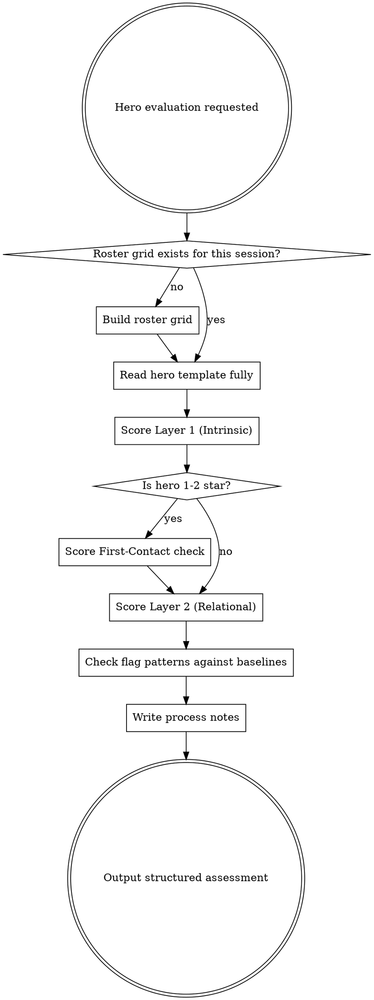

# Dorf Hero Design Diagnostic

Structured scorecard that identifies design mismatches in hero kits. Catches stat liars, dead skills, flat investment curves, roster redundancy, and complexity misfit — things that math alone won't reveal.

**Complements** `dorf-hero-evaluation` (numbers) and `dorf-cynic` (player frustration). This skill checks structural design integrity.

## Process



## Setup: Roster Grid

Before evaluating any hero, build a role x rarity grid from `src/data/heroes/`. This grid is input context for R1 and R4. Generate fresh each session — read all hero index files, map each hero to role (from class) and rarity.

Format:
```
| Role    | 1* | 2* | 3* | 4* | 5* |
|---------|----|----|----|----|-----|
| Tank    | .. | .. | .. | .. | ... |
| DPS     | .. | .. | .. | .. | ... |
| Healer  | .. | .. | .. | .. | ... |
| Support | .. | .. | .. | .. | ... |
```

Also note: saturated slots (3+ heroes same class/rarity) and empty slots (0 heroes for a role/rarity).

## Scale

- **P** (Problem) — This dimension has a flag worth investigating
- **F** (Fine) — Meets expectations for this hero's rarity tier
- **S** (Strength) — Notably well-executed

## Rarity Baselines

Scores are calibrated relative to these expectations. Flag severity = distance below baseline.

| Dimension | 1-star | 2-star | 3-star | 4-star | 5-star |
|-----------|--------|--------|--------|--------|--------|
| Complexity | 1-2 mechanics | 2 mechanics | 2-3 mechanics | 3-4 mechanics | 4+ interlocking |
| Decisions/Turn | 1 choice | 1-2 choices | 2 choices | 2-3 choices | 3+ trade-offs |
| Readability | Instant | Near-instant | Quick (one read) | Moderate study | Deep study OK |
| Synergy Surface | Self-contained OK | 0-1 connections | 1-2 connections | 2+ connections | Broad expected |
| Investment Payoff (R3b) | P is normal | P is normal | F baseline | F-S baseline | S expected |

**Flag severity:** Score at baseline = no flag. One step below = soft flag (note, investigate if compounds). Two steps below = hard flag (structural problem). Above baseline = strength or potential overdesign.

## Layer 1: Intrinsic (stable — doesn't change when roster changes)

| # | Dimension | Checks For |
|---|-----------|------------|
| I1 | **Complexity Budget** | Kit complexity vs rarity. Over OR under is a flag. |
| I2 | **Stat Clarity** | Do stats alone communicate a playstyle? When P, tag sub-type: **dead** (stat has no mechanical impact), **misleading** (stats suggest wrong role), or **contradicting** (stats work against the kit). |
| I3 | **Kit Coherence** | Do all skills serve one strategic identity? Skills only — do they pull the same direction? |
| I4 | **Decision Density** | Meaningful choices per turn, calibrated to rarity. |
| I5 | **Readability** | How quickly can a player grasp purpose, calibrated to rarity. |

**First-Contact (1-2 star only):**

| # | Dimension | Checks For |
|---|-----------|------------|
| FC | **First Skill Onboarding** | Is the first unlocked skill appropriate for a new player? How many concepts in one action? |

## Layer 2: Relational (shifts when roster/systems change — re-evaluate periodically)

| # | Dimension | Checks For |
|---|-----------|------------|
| R1 | **Roster Niche** | Unique strategic space at this rarity tier? |
| R2 | **Synergy Surface** | How many other heroes interact with this hero's mechanics? |
| R3a | **In-Fight Curve** | Does the hero play differently at turn 1 vs turn 5 vs turn 10? |
| R3b | **Investment Payoff** | Does spending resources (levels, merges, gear) change what the hero *contributes* — not just bigger numbers, but amplified strategic value? |
| R4 | **Role Tier Gap** | Does this role need filling at this rarity? |
| R5 | **Counterplay Surface** | Can encounters meaningfully interact with this hero's mechanics? |

## Flag Patterns

| Flag | Trigger | Meaning |
|------|---------|---------|
| **Stat Liar** | I2 = P | Stats promise something the kit doesn't deliver |
| **Orphan Kit** | I1-I3 all F/S, R1 or R2 = P | Well-designed hero, no home in roster |
| **Solved Hero** | I4 = P at 4-5 star | Premium hero that plays itself |
| **Complexity Trap** | I1 = P (over) + I5 = P | Too many mechanics AND hard to read |
| **The Island** | I3 = S, R2 = P | Coherent but self-contained, doesn't participate in team-building |
| **The Crutch** | I4 = P, R4 = S | Roster needs role, hero filling it is boring |
| **Flat Investment** | R3b = P (below baseline) | Resources don't change what hero contributes |
| **One-Phase** | R3a = P at 3+ star | No in-fight arc where one is expected |
| **Power Creep** | New hero R1 = S because existing hero's R1 dropped | Displaced, didn't expand |
| **First-Contact Overload** | FC = P (1-2 star) | First skill teaches too many concepts |

**Compound flag:** R4 = P with R1 = S means "hero is fine, roster allocation is the issue." Note it but don't flag the hero.

## Output Template

For each hero evaluated, produce:

```
## [Hero Name] — [Rarity]-star [Class]

### Context
[1-2 sentences: what this hero does, relevant roster position]

### Layer 1: Intrinsic
| Dim | Score | Reasoning |
|-----|-------|-----------|
| I1 Complexity | | |
| I2 Stat Clarity | | |
| I3 Kit Coherence | | |
| I4 Decision Density | | |
| I5 Readability | | |
[FC row if 1-2 star]

### Layer 2: Relational
| Dim | Score | Reasoning |
|-----|-------|-----------|
| R1 Roster Niche | | |
| R2 Synergy Surface | | |
| R3a In-Fight Curve | | |
| R3b Investment Payoff | | |
| R4 Role Tier Gap | | |
| R5 Counterplay Surface | | |

### Flags Triggered
[List flags with severity (soft/hard) and brief explanation, or "None"]

### Process Notes
[Observations that don't fit dimensions — new patterns spotted,
severity qualifications, dimension boundary questions, potential
new flags. These accumulate into skill refinement feedback.]
```

## Common Mistakes

- **Evaluating in absolute terms.** Always calibrate to rarity baseline. A 1-star with low decision density is fine. A 5-star with low decision density is a problem.
- **Scoring investment payoff as "stats go up."** R3b asks whether the hero's *strategic contribution* changes — not whether raw output increases linearly. ATK scaling a multiplicative combo chain = S. ATK scaling a flat-percentage kit = doesn't help.
- **Confusing dead stats with misleading stats.** Dead: stat has no mechanical use (ATK on all-noDamage kit). Misleading: stat suggests wrong role (DEF 8 on a tank). Both are I2 = P but different fixes.
- **Flagging R4 = P as a hero problem.** Saturated role tiers are roster architecture issues. If R1 = S (hero is differentiated), the hero isn't the problem — the roster allocation is.
